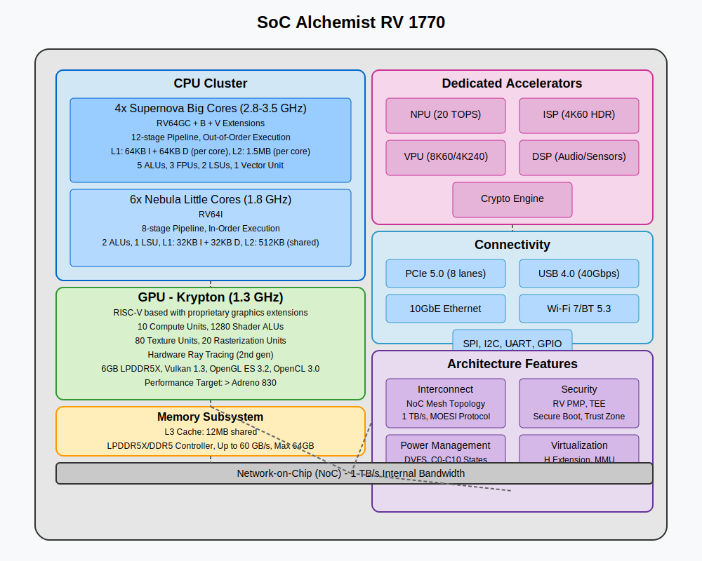

# 🧪 Alchemist RV: 64-bit RISC-V Architecture

<<<<<<< Updated upstream
## 📋 Visão Geral

O Alchemist RV é uma arquitetura SoC (System-on-Chip) pensada em 4nm (podendo ser fabricada e modificada em qualquer litografia) heterogênea baseada em RISC-V 64 bits, projetada
para oferecer alto desempenho e eficiência energética através de uma configuração big.LITTLE com GPU
integrada. Este repositório contém documentação, especificações técnicas e recursos para
desenvolvedores interessados em trabalhar com esta plataforma.
=======
## 📋 Overview
Alchemist RV is a heterogeneous 64-bit RISC-V based System-on-Chip (SoC) architecture designed at 4nm (but can be manufactured or adapted in any lithography), aimed at delivering high performance and energy efficiency through a big.LITTLE configuration with an integrated GPU. This repository contains documentation, technical specifications, and resources for developers interested in working with this platform.
>>>>>>> Stashed changes

## 🔍 Technical Specifications
### Basic Information
- SoC Name: Alchemist RV  
- Configuration: Hybrid big.LITTLE architecture with integrated GPU

### 🌟 Big Cores - "Supernova"
- Microarchitecture: Supernova RV64GCBV  
- ISA: RV64GC (RV64IMAFDC) + B (Bit Manipulation) and V (Vector) extensions  
- Frequency: 2.8 GHz - 3.5 GHz (boost)  
- Pipeline: 12 stages, superscalar, out-of-order execution  
- Cache: L1 64KB (I+D) per core, L2 1.5MB per core

### 💫 Little Cores - "Nebula"
- Microarchitecture: Nebula RV64I  
- ISA: RV64I (64-bit integer base)  
- Frequency: 1.8 GHz  
- Pipeline: 8 stages, in-order execution  
- Cache: L1 32KB (I+D) per core, L2 512KB shared

### 🎮 GPU - "Krypton"
- Architecture: RISC-V based with proprietary graphic extensions  
- Supported APIs: Vulkan 1.3, OpenGL ES 3.2, OpenCL 3.0, Ray Tracing API

### 🧠 Dedicated Accelerators
- NPU: 20 TOPS for AI workloads  
- ISP: Image processing up to 4K60 HDR  
- VPU: Encoding/decoding up to 8K60 or 4K240  
- DSP: Audio and sensor processing  
- Cryptography Engine: Hardware acceleration of cryptographic algorithms

### 🚀 Use Cases
Alchemist RV64 is ideal for:
- High-performance computing with energy efficiency  
- Next-generation mobile devices  
- Advanced embedded systems  
- AI and machine learning applications in edge computing  
- High-quality graphics processing  
- Compact servers with low power consumption

## 🛠 Development Tools
This repository includes:
- Detailed technical documentation  
- Software testing emulator  
- Software Development Kit (SDK)  
- Optimized libraries and APIs  
- Code examples and tutorials  
- Debugging and performance analysis tools

## SIMULATION
STILL UNDER DEVELOPMENT, NOT YET SIMULATED FOR ANY USE CASE!

Alchemist RV64 includes:
- Security Extensions: RV PMP (Physical Memory Protection)  
- TEE: Trusted Execution Environment with isolated secure zone  
- Accelerated cryptography: AES, SHA, RSA, ECC via hardware  
- Secure Boot: Cryptographic verification during boot  
- Trust Zone: Physical separation between secure and non-secure zones

## 👥 Contributions
Contributions are currently CLOSED, but will soon be open and welcome to anyone interested in contributing to the project.

# 📄 License
This project is licensed under the MIT License – see the LICENSE file for details.
