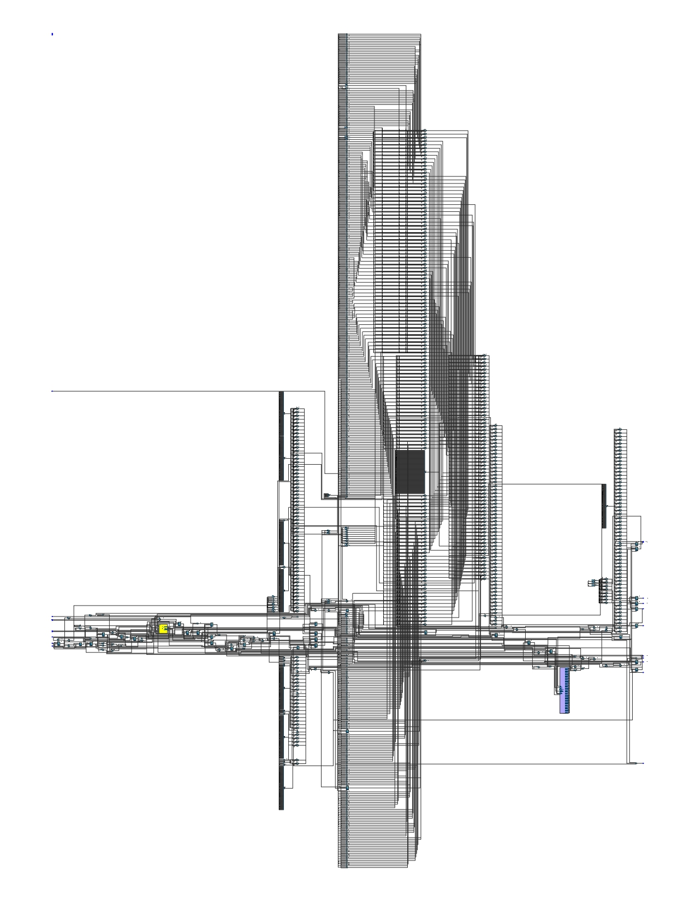

# 🧪 Alchemist RV: 64-bit RISC-V Architecture

## 📋 Overview

Alchemist RV is a heterogeneous 64-bit RISC-V based System-on-Chip (SoC) architecture designed at 4nm (but can be manufactured or adapted in any lithography), aimed at delivering high performance and energy efficiency through a big.LITTLE configuration with an integrated GPU. This repository contains documentation, technical specifications, and resources for developers interested in working with this platform.

## 🔍 Technical Specifications
### Basic Information
- SoC Name: Alchemist RV  
- Configuration: Hybrid big.LITTLE architecture with integrated GPU

### 🌟 Big Cores - "Supernova"
- Microarchitecture: Supernova RV64GCBV  
- ISA: RV64GC (RV64IMAFDC) + B (Bit Manipulation) and V (Vector) extensions  
- Frequency: 2.8 GHz - 3.5 GHz (boost)  
- Pipeline: 12 stages, superscalar, out-of-order execution  
- Cache: L1 64KB (I+D) per core, L2 1.5MB per core

### 💫 Little Cores - "Nebula"

- Microarchitecture: Nebula RV64I  
- ISA: RV64I (64-bit integer base)  
- Frequency: 1.8 GHz  
- Pipeline: 8 stages, in-order execution (2 instructions per clock)
- Cache: L1 32KB (I+D) per core, L2 512KB shared

### 🎮 GPU - "Krypton"
- Microarchitecture: Krypton RV GPU  
- Supported APIs: Vulkan 1.3, OpenGL ES 3.2, OpenCL 3.0, Ray Tracing API

### 🧠 Dedicated Accelerators
- NPU: 20 TOPS for AI workloads  
- ISP: Image processing up to 4K60 HDR  
- VPU: Encoding/decoding up to 8K60 or 4K240  
- DSP: Audio and sensor processing  
- Cryptography Engine: Hardware acceleration of cryptographic algorithms

### 🚀 Use Cases
Alchemist RV64 is ideal for:
- High-performance computing with energy efficiency  
- Next-generation mobile devices  
- Advanced embedded systems  
- AI and machine learning applications in edge computing  
- High-quality graphics processing  
- Compact servers with low power consumption

## 🛠 Development Tools
This repository includes:
- Detailed technical documentation  
- Software testing emulator  
- Software Development Kit (SDK)  
- Optimized libraries and APIs  
- Code examples and tutorials  
- Debugging and performance analysis tools

Alchemist RV64 includes:
- Security Extensions: RV PMP (Physical Memory Protection)  
- TEE: Trusted Execution Environment with isolated secure zone  
- Accelerated cryptography: AES, SHA, RSA, ECC via hardware  
- Secure Boot: Cryptographic verification during boot  
- Trust Zone: Physical separation between secure and non-secure zones

## SIMULATION
### Nebula Core simulation
Still working in simulation of input data (imem_data) in queue, because multiples input can be real in a OS, so we simulate the Nebula Core with a Input Queue to write in registers, but is in development in this moment.
ADDI and ADD instructions has been simulated and passed of testbench in verilator write in Registers and ALU ADDI/ADD.
### 
STILL UNDER DEVELOPMENT, NOT YET SIMULATED FOR ANY USE CASE!

## 👥 Contributions
Contributions are currently CLOSED, but will soon be open and welcome to anyone interested in contributing to the project.

# 📄 License
This project is licensed under the MIT License – see the LICENSE file for details.
